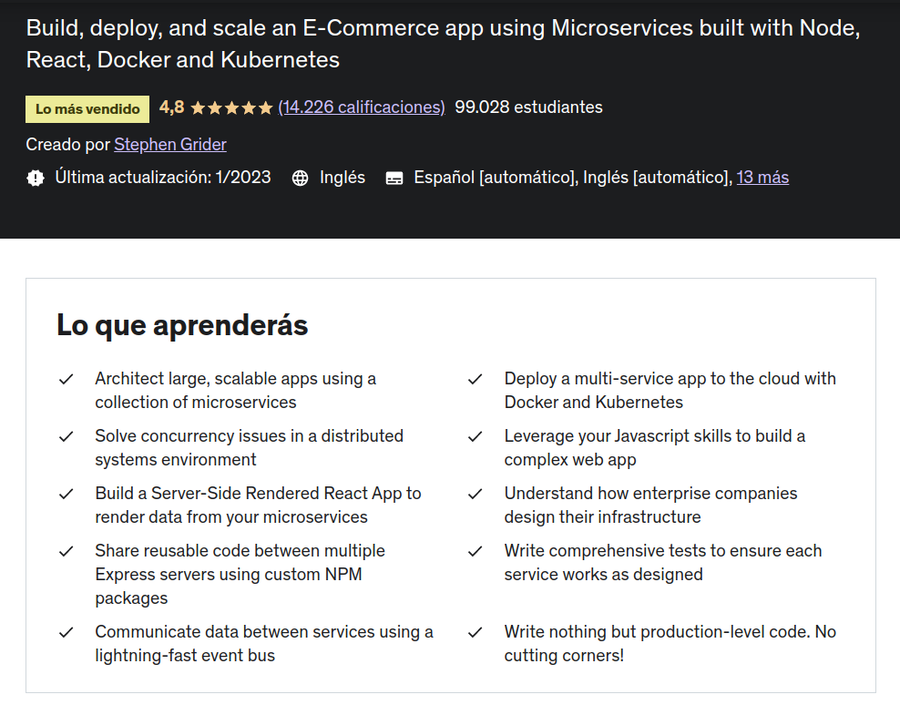

# Udemy Course MicroService with nodejs and React js (events hardcode part)

## Introduction

An application of posts with comments that shows the use of events to communicate the different micro services.

[Link to course](https://www.udemy.com/course/microservices-with-node-js-and-react/)

## Technology Stack & Tools

- Visual Studio Code
- nvm / nodejs / npm / npx
- Javascript (React & Testing)
- Express
- reactjs
- micro-services
- Docker
- Kubernetes

## Requirements For Initial Setup

- Install [NodeJS](https://nodejs.org/)
- Docker, Docker-compose
- Kubernetes ([kubectl](https://kubernetes.io/docs/tasks/tools/install-kubectl-linux/))
- miniKube (linux)

## Setting Up
### 1. Clone/Download the Repository
`$ git clone repo_url`

### 2. Install Dependencies
`$ npm install` (in each folder)

### 3. Start each services

  `$ npm run start`

### 4. Start app

  `$ npm run start`

### 5. Start kubectl with miniKube in Linux

  `$ minikube kubectl -- get pods -A`

### 6. Create pods

  `$ kubectl apply -f file.yaml`

### 7. Get pods

  `$ kubectl get pods`
  
---

# References

- [Kubectl Errors](./.doc/knowErrors/kubectl-errors.md)
- [Lubectl Commands](./.doc/kubectl-commands.md)
- [minikube Errors](https://stackoverflow.com/questions/60556096/unable-to-get-clusterip-service-url-from-minikube)
