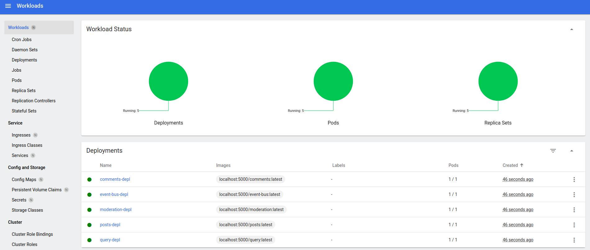

# Udemy Course MicroService with nodejs and React js (events hardcode part)

## Introduction

An application of posts with comments that shows the use of events to communicate the different micro services.

[Link to course](https://www.udemy.com/course/microservices-with-node-js-and-react/)

Note: All commands and script are prepared to run in Linux with minikube.

## Technology Stack & Tools

- Visual Studio Code
- nvm / nodejs / npm / npx
- Javascript (React & Testing)
- Express
- reactjs
- micro-services
- minikube
- [Ingress-nginx](https://github.com/kubernetes/ingress-nginx)
- Docker
- Kubernetes

## Requirements For Initial Setup

- Install [NodeJS](https://nodejs.org/)
- Docker, Docker-compose
- Kubernetes ([kubectl](https://kubernetes.io/docs/tasks/tools/install-kubectl-linux/))
- miniKube (linux)

## Setting Up
### 1. Clone/Download the Repository
`$ git clone repo_url`

### 2. Install Dependencies
`$ npm install` (in each folder)

### 3. Start kubectl with miniKube in Linux

  `$ minikube start`
  `$ minikube addons enable registry`
  `$ minikube addons enable ingress`
  `$ minikube addons enable dashboard`
  `$ eval $(minikube docker-env)`

  Note: You have to run eval $(minikube docker-env) on each terminal you want to use, since it only sets the environment variables for the current shell session

### 4. kubectl port-forward

  In order to make docker accept pushing images to this registry, we have to redirect port 5000 on the docker virtual machine over to port 80 on the minikube registry service. Unfortunately, the docker vm cannot directly see the IP address of the minikube vm. To fix this, you will have to add one more level of redirection.

  Use kubectl port-forward to map your local workstation to the minikube vm

    `$ kubectl port-forward --namespace kube-system service/registry 5000:80`

  [More info](https://minikube.sigs.k8s.io/docs/handbook/registry/)

### 5. Build images and put local registry

  `$ ./scripts/minikube-build-images.sh`

### 6. update hosts file
  Add these entries:

  192.168.49.2   posts.com 
  (minikube ip)

### 7. Run Infrastructuro

  `$ ./scripts/kubect-deploy-all.sh`

### 8. Access to API

  - get minikube IP

  `$ minikube UP`

  - Get pod exposed port

  `$ kbuectl get services`

  - Access to endpoints

  `$ http://localhost:[IP from minikube IP command]:[port from kubectl get services]/[endpoint]`

  Example: `$ http://localhost:192.168.49.2:30257/posts`

### Other Comamnds

  - get specific pod port:

  `$ kubectl exec posts-depl-6c445fcf4d-qpx95 -- netstat -tupln`

  - Check someting running in port 80

  `$ sudo lsof -i tcp:80`

  - Open minikube Dashboard

  `$ minikube Dashboard`

---

# References

- [Kubectl Errors](./.doc/knowErrors/kubectl-errors.md)
- [Lubectl Commands](./.doc/kubectl-commands.md)
- [minikube Errors](https://stackoverflow.com/questions/60556096/unable-to-get-clusterip-service-url-from-minikube)
- [minikube Error ImagePullBackOff local repository with Minikube](https://stackoverflow.com/questions/38979231/imagepullbackoff-local-repository-with-minikube)
- [minikube Error registry](https://stackoverflow.com/questions/74493358/docker-manifest-unknown-from-local-docker-registry)
- [minikube run local images](https://stackoverflow.com/questions/42564058/how-to-use-local-docker-images-with-minikube)
- [kubernetes ingress nginx installation guide](https://kubernetes.github.io/ingress-nginx/deploy/)